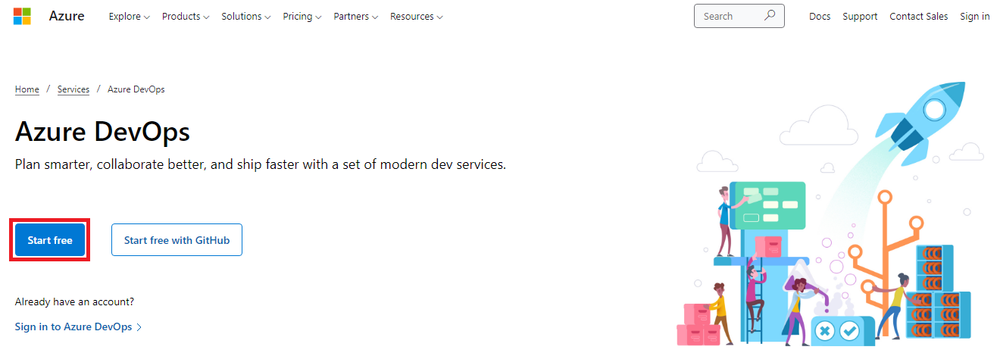
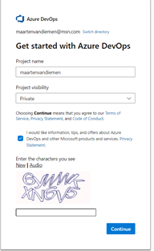
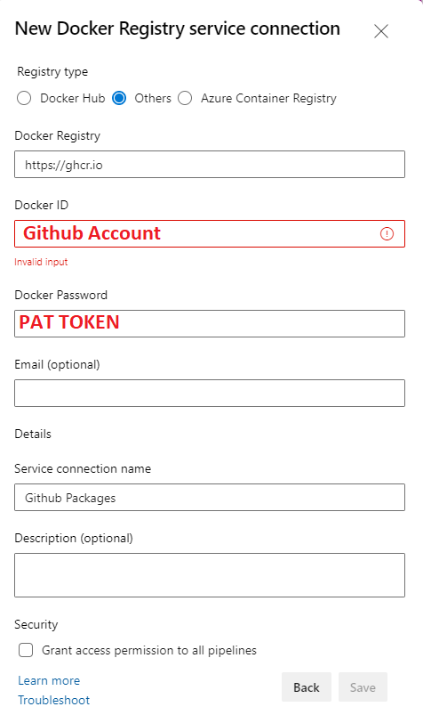

| Build | Status |
| ------------- | ------------- |
| Github Actions no docker  |  |
| Github Actions docker |  |
| Azure Devops no docker |  |
| Azure Devops docker |  |

Demo project of an ASP.NET Core 9 minimal API's. Inspired by the demo from [Daniel Roth](https://twitter.com/danroth27) that has been given at [dotnetconf](https://www.dotnetconf.net). See the original presentation below: 

# Prerequisites
## Prerequisites Github
The following prerequisites are required before executing the pipelines:

1. Ensure you have a Github account
1. Create a [new public repository](https://docs.github.com/en/repositories/creating-and-managing-repositories/creating-a-new-repository)
1. Create a new [Action Secret for the repository](https://docs.github.com/en/actions/security-guides/encrypted-secrets#creating-encrypted-secrets-for-a-repository) with the name: `SA_PASSWORD`. The value of this field should be a [complex password according to SQL Server](https://learn.microsoft.com/en-us/sql/relational-databases/security/password-policy).
1. Create a new [Action Secret for the repository](https://docs.github.com/en/actions/security-guides/encrypted-secrets#creating-encrypted-secrets-for-a-repository) with the name: `AZURE_SQL_USER`. Name of the admin user for SQL Server.
1. Create a service principal as described [here](https://learn.microsoft.com/en-us/azure/developer/github/connect-from-azure?tabs=azure-portal%2Cwindows#use-the-azure-login-action-with-a-service-principal-secret) and store it as an Repository secret with the name `AZURE_CREDENTIALS`
  - Grant the service principal the _owner_ role on subscription level
  - Grant the service principal the _User Account Administrator_ role on subscription level
1. Create a new [environment](https://docs.github.com/en/actions/deployment/targeting-different-environments/using-environments-for-deployment) with the name: _AzureProvision_:
  - Create a secret `SUBSCRIPTION` the value is the subscription id in which the service principal above is created
  - Create a secret `DATACENTER` the value is the region of Azure in which the resources will be deployed
1. Create a new [environment](https://docs.github.com/en/actions/deployment/targeting-different-environments/using-environments-for-deployment) with the name: _AzureRemove_:
  - Add a reviewer to the environment

## Prerequisites Azure Devops
The following prerequisites are required before executing the pipelines:

1. Ensure you have a Microsoft account
   - If you don't have a Microsoft account signup [here](https://account.microsoft.com) for a new one.
1. Browse to: https://dev.azure.com and select '_start for free_'   
1. Fill in the data and pick a name for your project. Set project visibility to '_private_'   
1. Note down the name of your Azure Devops organization you just created. The name of the organization is the same name as the project that is just created. So: `dev.azure.com/<JustCreatedProjectName>`
1. Create a request for parallel jobs [through this form](https://aka.ms/azpipelines-parallelism-request). Fill in with the following data:   
   - Wait untill the request is approved.

### CI build (nodocker)
1. [Import the code](https://learn.microsoft.com/en-us/azure/devops/repos/git/import-git-repository) of this repo in Azure Devops.
1. [Create a variable group](https://learn.microsoft.com/en-us/azure/devops/pipelines/library/variable-groups) with the name: _TodoItemsApi-Build_.
   - Create in this variable group a variable named: `SA_PASSWORD`. The value of this field should be a [complex password according to SQL Server](https://learn.microsoft.com/en-us/sql/relational-databases/security/password-policy). Make this field a secret.
1. Create an [Azure Resource Manager Service Connection](https://learn.microsoft.com/en-us/azure/devops/pipelines/library/connect-to-azure) (Service Principal)
   - Name the service connection: _Azure_
   - Grant the service principal the _owner_ role on subscription level
   - Grant the service principal the _User Account Administrator_ role on subscription level
1. [Create a variable group](https://learn.microsoft.com/en-us/azure/devops/pipelines/library/variable-groups) with the name: _AzureSecrets_ and create the following variables:
   - `subscriptionId` value the subscription id of the Azure subscription for which a service connection is created in the steps above.
   - `todoItemsSqlAdminpassword` The value of this field should be a [complex password according to SQL Server](https://learn.microsoft.com/en-us/sql/relational-databases/security/password-policy). Make this field a secret.
   - `todoItemsSqlAdminUser` Name of the admin user for SQL Server.
3. Import nodocker.yml

### CI build (docker)
1. Follow the steps in [CI build](#ci-build-nodocker)
1. Create a Github Account
   - Create a PAT token. Enable the scopes `write:packages`.
1. Create a new Service Connection with the following content   
1. Import docker.yml
